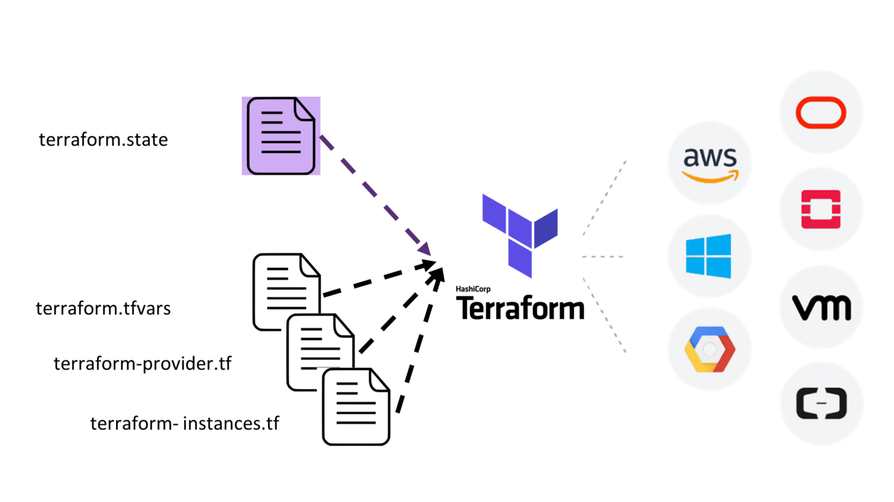

# Terraform 101

## What is Terraform?
Terraform is an infra-as-code framework that figures out how to make your desired state into reality.

* Allows you to declare the desired state of your infrastructure 
* Will go figure out what the current state of your infrastructure is
* Diffs the current vs desired states and comes up with a series of actions that must be taken
* Performs the series of actions

## Architecture

Source: https://medium.com/hackernoon/terraform-openstack-ansible-d680ea466e22

## Key Terms
* Statefile - a mapping of the resources declared in your code to what exists in the infrastructure provider.
* Plan - 
* Apply
* Provider

## Getting Started
This tutorial is going to focus on learning Terraform basics using Azure.
1. Install Terraform:
    ```
    brew tap hashicorp/tap && brew install hashicorp/tap/terraform
    ```
    If you already have Terraform, upgrade to the latest version:
    ```
    brew upgrade hashicorp/tap/terraform
    ```
1. Install the Azure CLI:
    ```
    brew update && brew install azure-cli
    ```
1. Login into Azure
    1. Authenticate your Azure CLI
        ```
        $ az login
        ```
    1. List your subscriptions and pick which one you want to use
        ```
        $ az account list --query "[].{name:name, subscriptionId:id}"
        ```
    1. Set your subscription
        ```
        $ az account set --subscription="<subscription_id>"
        ```

## Create your Terraform file
Let's call it `main.tf` and fill it with a single provider block. A provider is responsible for understanding API interactions and exposing resources. Most providers configure a specific infrastructure platform (either cloud or self-hosted).

In this case, we are pulling in the AzureRM provider.
```
provider "azurerm" {
  version = "~>2.0"
  features {}
}
```

## Initialize Terraform
The terraform init command is used to initialize a working directory containing Terraform configuration files.
```
$ terraform init
```

Two things happened behind the scenes:
* `.terraform` folder was created. This will eventually contain:
    * Binaries of any providers that are used in your code
    * `lock.json` - mapping of providers to specific commit hashes of the versions deployed
* `azurerm` provider was downloaded from the [Terraform Registry](https://registry.terraform.io).

Now we're ready to start defining resources.

## Resource Block
Resources are the most important element in the Terraform language. Each resource block describes one or more infrastructure objects, such as virtual networks, compute instances, or higher-level components such as DNS records.

In this case, we are creating a new Azure `Resource Group` (note this is an Azure specific construct, similar to a folder for associating your Azure resources). Add in the following block to the end of your `main.tf` file:
```
resource "azurerm_resource_group" "rg" {
  name = "<your_resource_group_name>"
  location = "westus"
}
```

## Terraform Plan
The terraform plan command is used to create an execution plan. Terraform performs a refresh, unless explicitly disabled, and then determines what actions are necessary to achieve the desired state specified in the configuration files.
```
$ terraform plan
```

Review the output to make sure 

## Terraform Apply

## Modify a resource

## Inspect Terraform state file

## Check for drift and re-sync

## Terraform Import

## Terraform Destroy